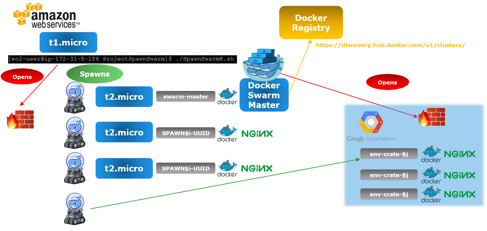

# ProjectSpawnSwarm
Project to spawn Web servers using Docker Machine, Docker Swarm and Docker Discovery (Consul still TBI)

Tested on a t1.micro AMI

To install the prerequisites on an AMI image use this piece of code:

https://github.com/FabioChiodini/AWSDockermachine

## Script Flow

This script creates:

- one VM with Consul in Docker (used also to prepare docker Discovery)

- One VM hosting the Docker swarm in a Docker container

- A number of VMs in AWS (specified in the variable export VM_InstancesK) as "slaves"

- A number of VMs in GCE (specified in the variable export GCEVM_InstancesK) as "slaves" (still TBC) 


It then starts many Docker Containers (nginx) via Docker Swarm (the number of instances is specified in the variable export InstancesK)

It also opens up all required port on AWS Security Groups and on GCE

Currently it opens all ports for Docker Swarm /machine and ssh plus port 80 (for the Docker application)

Here's an high level diagram: 



## Environment Variables

It uses a file to load the variables needed (/home/ec2-user/Cloud1).

This file has the following format:

```
export K1_AWS_ACCESS_KEY=AKXXXXXX

export K1_AWS_SECRET_KEY=LXXXXXXXXXX

export K1_AWS_VPC_ID=vpc-XXXXXX

export K1_AWS_ZONE=b

export K1_AWS_DEFAULT_REGION=us-east-1

export AWS_DEFAULT_REGION=us-east-1

export VM_InstancesK=2
export Container_InstancesK=3

export GCEKProvision=1

export GCEVM_InstancesK=1


export K2_GOOGLE_AUTH_EMAIL=XXXXX@developer.gserviceaccount.com
export K2_GOOGLE_PROJECT=XXXXXX
export GOOGLE_APPLICATION_CREDENTIALS="/home/ec2-user/GCEkeyfile.json"
```

The first five variable are used by the docker-machine command, the export AWS_DEFAULT_REGION variable is used by AWS cli (to edit the security group) VM_InstancesK and VM_InstancesK are used to determine the VM/Containers instances to run

GCEKProvision is a flag to enable provisioning on GCE

K2_GOOGLE_AUTH_EMAIL contains the google account email for your GCE project (shown in the manage service accounts panel, this is NOT your google email :P)

K2_GOOGLE_PROJECT contains the project to targte for GCE

GOOGLE_APPLICATION_CREDENTIALS maps to a file containing the Service account keys for your GCE Compute engine


## NOTES ON Spawning to GCE

To spawn VMs to GCE you need to set up an account, following are the high level steps:

- Enable the Compute Engine API

- Create credentials (Service account keys type - JSON format) and download the json file to /home/ec2-user/GCEkeyfile.json

- Enable billing for your account

[Following steps must still be automated]

Launch interactively (one time) this command:

- gcloud auth login

- From the output of the command get the https link and paste it into a browser

- From the browser authorize the access and get the string

- Relaunch the command

- gcloud auth login

- Paste the string when asked

-->>> I still have to make the GCE auth totally transparent :P


@FabioChiodini
